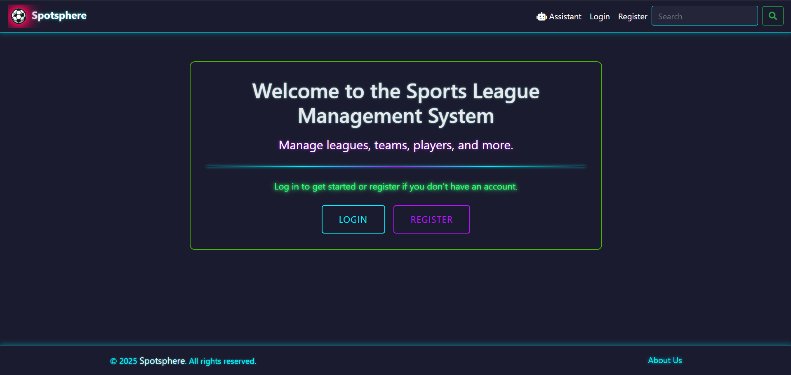
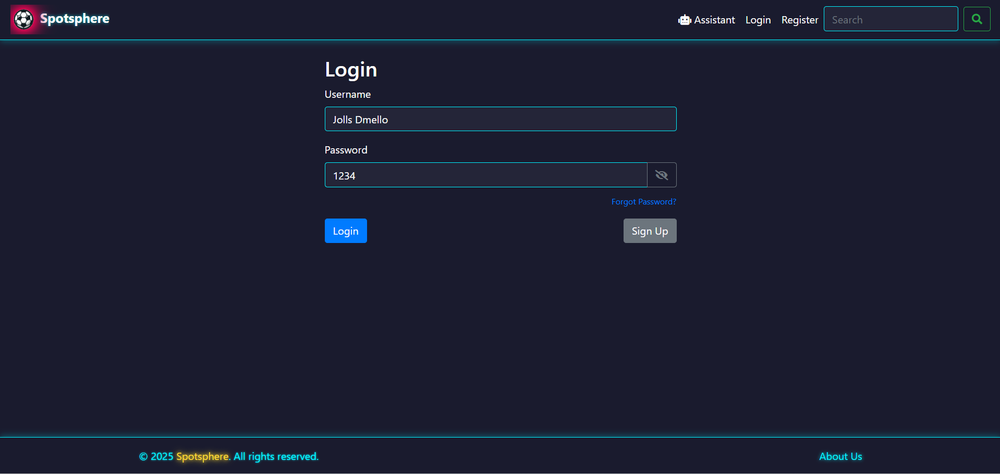
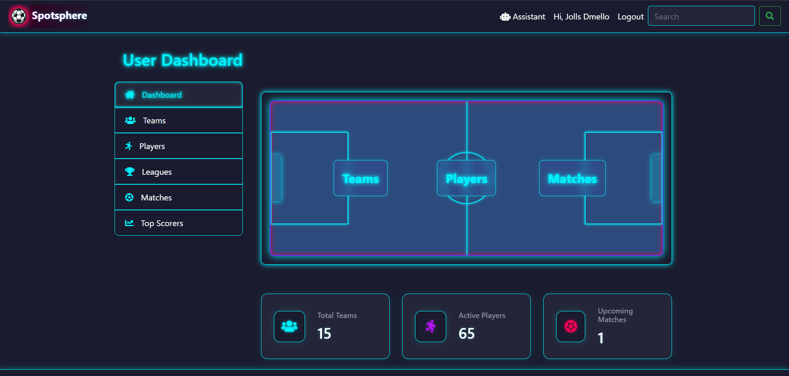
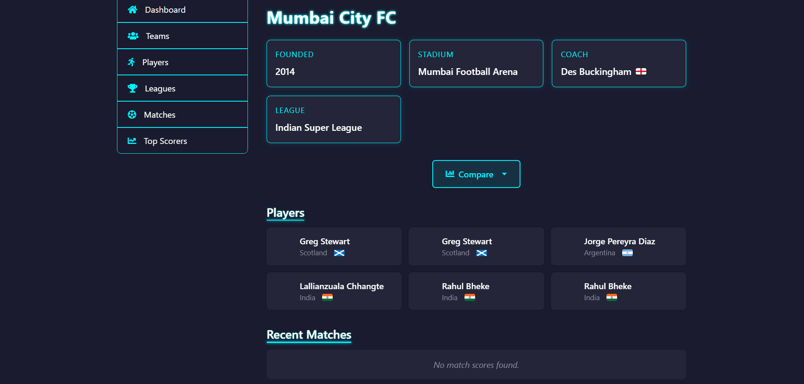
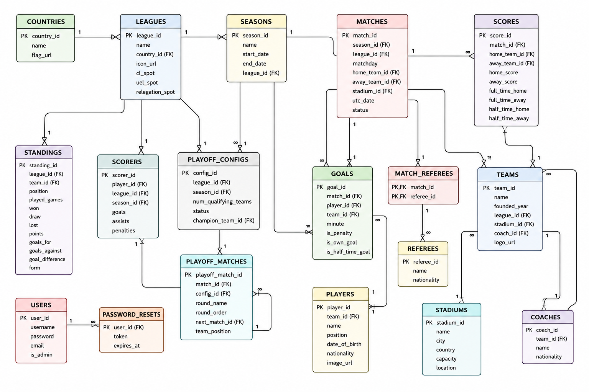

# SportSphere

SportSphere is a Flask and PostgreSQL football-league management system. It provides role-based administration for league data and a public-facing dashboard for browsing teams, players, leagues, fixtures, results, standings, scorers, and statistics.

## Features

- User registration, login, logout, profile editing, and bcrypt password hashing
- Admin-only CRUD screens for countries, leagues, seasons, stadiums, teams, coaches, players, matches, referees, scores, goals, scorers, standings, and users
- Team, player, match, and league profile pages
- Search across teams, coaches, players, stadiums, and leagues
- Filtering and pagination for teams and players
- Player and team comparison pages
- Top-scorer and Indian Super League statistics
- Rule-based football assistant backed by PostgreSQL data
- Welcome and password-reset email workflows through SMTP
- Seed data and PostgreSQL schema for local development

## Technology stack

| Area | Technology |
| --- | --- |
| Backend | Python, Flask 3 |
| Database | PostgreSQL |
| Database driver | psycopg2-binary |
| Authentication | Flask sessions and bcrypt |
| Templates | Jinja2, HTML, CSS, JavaScript |
| Email | Flask-Mail and Gmail SMTP |
| HTTP/API integration | Requests; football-data API configuration is supported |
| Deployment server | Gunicorn |
| Configuration | python-dotenv |

## Requirements

- Python 3.10 or newer
- PostgreSQL 14 or newer
- Git

## Installation

### 1. Clone the repository

```powershell
git clone <repository-url>
cd Sports-League-Management-System-new
```

### 2. Create and activate a virtual environment

```powershell
py -m venv .venv
.\.venv\Scripts\Activate.ps1
```

On macOS/Linux:

```bash
python3 -m venv .venv
source .venv/bin/activate
```

### 3. Install dependencies

```bash
python -m pip install --upgrade pip
pip install -r requirements.txt
```

### 4. Configure environment variables

Copy `.env.example` to `.env` and replace the placeholders with local values. Never commit `.env`.

```powershell
Copy-Item .env.example .env
```

At minimum, configure `SECRET_KEY` and `DATABASE_URL`. SMTP values are required only for welcome and password-reset email delivery.

For this local demo database, an administrator account currently exists with username `admin` and password `admin`. This account is for local testing/demo purposes only. Change or remove it before any real deployment, and do not treat these credentials as production credentials.

### 5. Create and initialize PostgreSQL

Create a database named `sports_league_db`, then load the schema and seed data:

```bash
createdb -U postgres sports_league_db
psql -U postgres -d sports_league_db -f schema.sql
```

If the database already exists, load the schema only when it is safe to replace its contents; the schema contains destructive `DROP TABLE` statements.

### 6. Run the application

```bash
python -m flask --app main run --debug
```

Open http://127.0.0.1:5000.

For a production WSGI process, use Gunicorn in a suitable Linux deployment environment:

```bash
gunicorn main:app
```

## Project structure

```text
main.py              Flask entry point and account/general routes
admin_routes.py      Admin CRUD blueprint
user_routes.py       User dashboard and profile blueprint
chatbot_routes.py    Rule-based football assistant
db.py                PostgreSQL connection and database utilities
config.py             Environment-backed application configuration
mail.py              Welcome and password-reset email helpers
schema.sql            Current PostgreSQL schema and seed data
templates/            Jinja pages and shared layouts
static/               CSS, JavaScript, logos, flags, and player images
update_*.py/sql       Data maintenance utilities
playoff_test/         Separate hardcoded playoff-bracket prototype
registration mail/    Separate contact/registration prototype
simulator/            Inactive simulator prototype
```

The active application is launched from `main.py`. The separate `playoff_test/`, `registration mail/`, and `simulator/` directories are prototypes and are not imported or registered by the active Flask application.

## Screenshots

### Landing page



### Login page



### User dashboard



### Team profile



## Database schema



## Main routes

- `/` — landing page
- `/login`, `/register`, `/logout` — account access
- `/dashboard` — user dashboard
- `/admin` — administrator dashboard
- `/user/teams`, `/user/players`, `/user/leagues`, `/user/matches` — catalog pages
- `/team/<id>`, `/player/<id>`, `/match/<id>`, `/league/<id>` — profile pages
- `/user/scorers`, `/isl_stats` — statistics
- `/compare/players`, `/compare/teams` — comparisons
- `/assistant/` — football assistant
- `/manage_*` — administrator management screens

## Known limitations

- CSRF protection is not implemented yet; it should be added before public deployment.
- There is no automated test suite yet.
- Destructive administrative routes such as `/recreate_db` need access restriction or removal before any public deployment.
- The database schema and route code should be consolidated further; old prototypes remain separate from the active application.
- Email sending is optional and is not configured by default. `MAIL_PASSWORD` may remain `YOUR_APP_PASSWORD_HERE` when email is not needed for local testing; the app logs a clear warning and continues without sending. When enabled, email delivery requires valid SMTP credentials and should use a production job queue rather than an in-process background thread.
- The application currently targets local PostgreSQL and has no production deployment configuration.

## Security notes

- Keep `.env` private and rotate any credentials that may have been exposed.
- Use a strong unique `SECRET_KEY`.
- Do not publish real personal email addresses or plaintext passwords in seed data.
- Review database seed data before pushing this repository publicly.

## License

This project is licensed under the MIT License.  
Copyright (c) 2025 kaimg  
Copyright (c) 2026 JOLLS

This project was originally based on an MIT‑licensed repo by kaimg. It has since been expanded with new pages, tools, and database connections and other features which are developed by Me and My team.